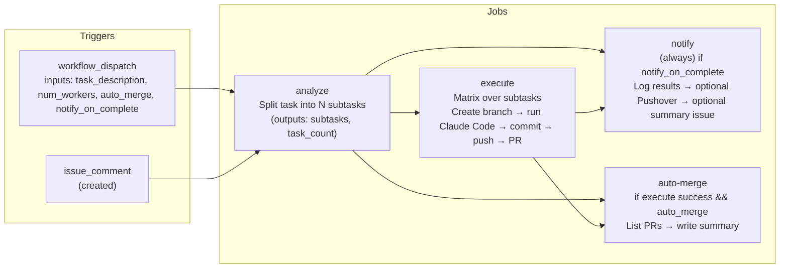

# Parallel Claude Tasks workflow (diagram)

GitHub renders Mermaid diagrams automatically in Markdown files. This diagram shows the **job-level** flow of `workflows/parallel-tasks.yml`.

## Notes

- The `execute` job runs **in parallel** via a matrix over `needs.analyze.outputs.subtasks`.
- `notify` runs even if some matrix jobs fail (`if: always()`), but only when `notify_on_complete` is true.
- `auto-merge` is a summary/reporting job in this workflow (it does not actually merge PRs as written).
